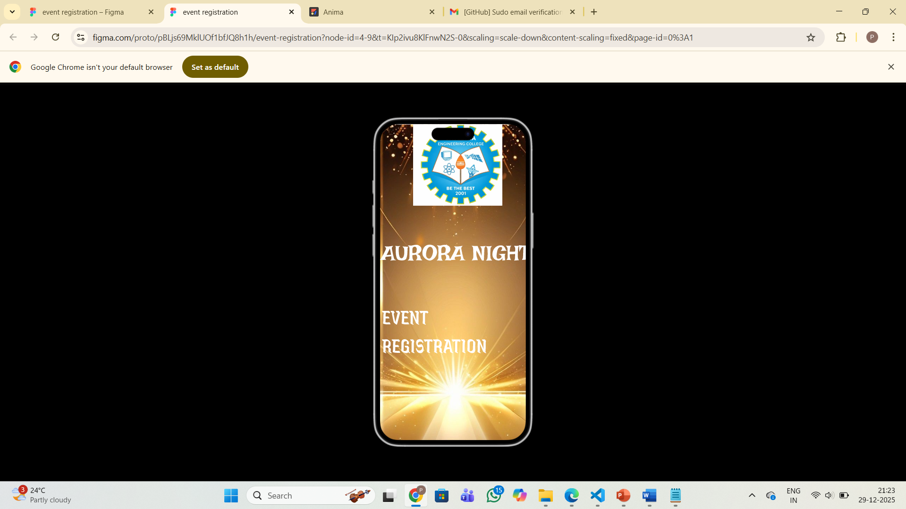
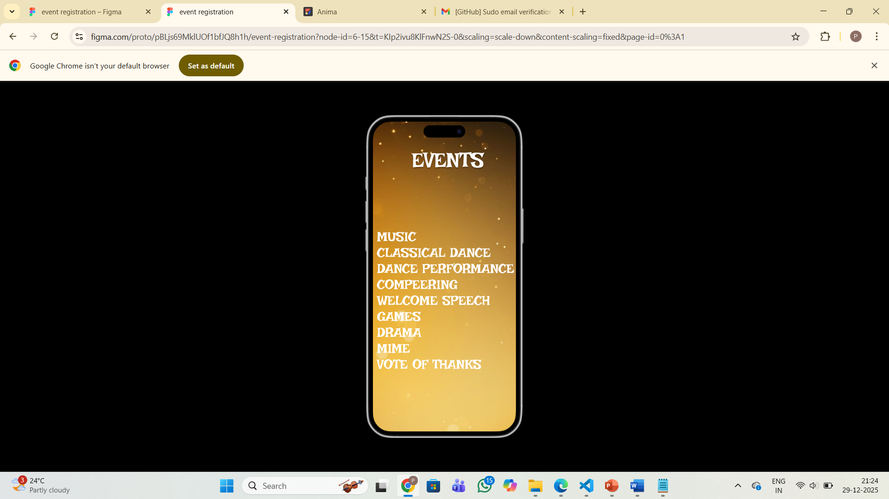
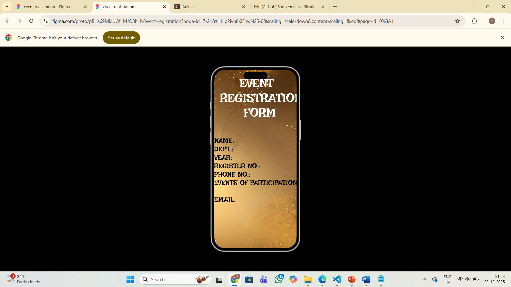
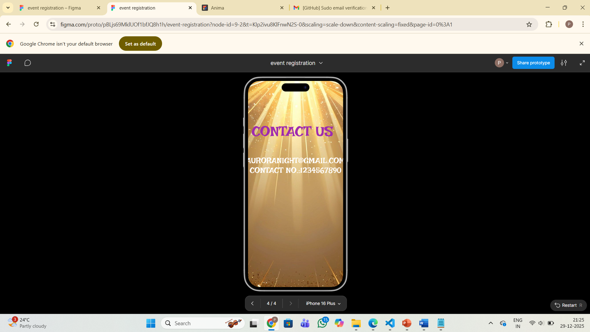

# Ex09 Event Registration Web Application
# Date:
# AIM:
To design, develop and deploy a web application for event registration.

# DESIGN STEPS:
## Step 1:
Create a new frame.

## Step 2:
Select any one preset size of your choice.

## Step 3:
Select the shapes you need.

## Step 4:
Import images as needed.

## Step 5:
Create pages based on your need and link them.

## Step 6:
Validate the HTML and CSS code.

## Step 6:
Publish the website in the given URL.

# DESIGN TOOL:
Figma

# CODE:
```
page1

.iphone-plus {
  background-color: #ffffff;
  width: 100%;
  min-width: 563px;
  min-height: 1008px;
  position: relative;
}

.iphone-plus .image {
  position: absolute;
  top: 0;
  left: 0;
  width: 563px;
  height: 1008px;
  aspect-ratio: 0.75;
  object-fit: cover;
}

.iphone-plus .AURORA-NIGHT {
  position: absolute;
  top: 341px;
  left: 47px;
  width: 469px;
  font-family: "Irish Grover-Regular", Helvetica;
  font-weight: 400;
  color: #ffffff;
  font-size: 64px;
  letter-spacing: 0;
  line-height: normal;
}

.iphone-plus .text-wrapper {
  position: absolute;
  top: 524px;
  left: 70px;
  width: 446px;
  font-family: "Jaini Purva-Regular", Helvetica;
  font-weight: 400;
  color: #ffffff;
  font-size: 64px;
  letter-spacing: 0;
  line-height: normal;
}

.iphone-plus .logo {
    position: absolute;
    top: 0;
    left: 162px;
    width: 263px;
    height: 240px;
    aspect-ratio: 1.09;
    object-fit: cover;
}


page2

.iphone-plus {
  background-color: #ffffff;
  width: 100%;
  min-width: 563px;
  min-height: 1008px;
  position: relative;
}

.iphone-plus .image {
  position: absolute;
  top: 0;
  left: 0;
  width: 563px;
  height: 1008px;
  aspect-ratio: 0.56;
  object-fit: cover;
}

.iphone-plus .EVENTS {
  position: absolute;
  top: 80px;
  left: calc(50.00% - 202px);
  width: 403px;
  text-shadow: 0px 4px 4px #00000040;
  font-family: "Irish Grover-Regular", Helvetica;
  font-weight: 400;
  color: #ffffff;
  font-size: 64px;
  letter-spacing: 0;
  line-height: normal;
}

.iphone-plus .MUSIC-CLASSICAL {
  position: absolute;
  top: 325px;
  left: 58px;
  width: 439px;
  font-family: "Irish Grover-Regular", Helvetica;
  font-weight: 400;
  color: #ffffff;
  font-size: 40px;
  letter-spacing: 0;
  line-height: normal;
}


page3

.iphone-plus {
  background-color: #ffffff;
  width: 100%;
  min-width: 564px;
  min-height: 1008px;
  position: relative;
}

.iphone-plus .image {
  position: absolute;
  top: 0;
  left: 0;
  width: 564px;
  height: 1008px;
  aspect-ratio: 0.75;
  object-fit: cover;
}

.iphone-plus .EVENT-REGISTRATION {
  position: absolute;
  top: 31px;
  left: 19px;
  width: 521px;
  font-family: "Irish Grover-Regular", Helvetica;
  font-weight: 400;
  color: #ffffff;
  font-size: 64px;
  letter-spacing: 0;
  line-height: normal;
}

.iphone-plus .NAME-DEPT-YEAR {
  position: absolute;
  top: 348px;
  left: 29px;
  width: 499px;
  font-family: "Irish Grover-Regular", Helvetica;
  font-weight: 400;
  color: #000000;
  font-size: 36px;
  letter-spacing: 0;
  line-height: normal;
}


page4

.iphone-plus {
  background-color: #ffffff;
  width: 100%;
  min-width: 564px;
  min-height: 1008px;
  position: relative;
}

.iphone-plus .image {
  position: absolute;
  top: 0;
  left: 0;
  width: 564px;
  height: 1008px;
  aspect-ratio: 0.75;
  object-fit: cover;
}

.iphone-plus .text-wrapper {
  position: absolute;
  top: 189px;
  left: 85px;
  width: 372px;
  font-family: "Irish Grover-Regular", Helvetica;
  font-weight: 400;
  color: #9f2aae;
  font-size: 64px;
  letter-spacing: 0;
  line-height: normal;
}

.iphone-plus .AURORANIGHT-GMAIL {
  position: absolute;
  top: 337px;
  left: calc(50.00% - 282px);
  width: 564px;
  font-family: "Irish Grover-Regular", Helvetica;
  font-weight: 400;
  color: #ffffff;
  font-size: 36px;
  text-align: center;
  letter-spacing: 0;
  line-height: normal;
}


```
# OUTPUT:





# RESULT:
The program to design, develop and deploy a web application for event registration is completed successfully.
